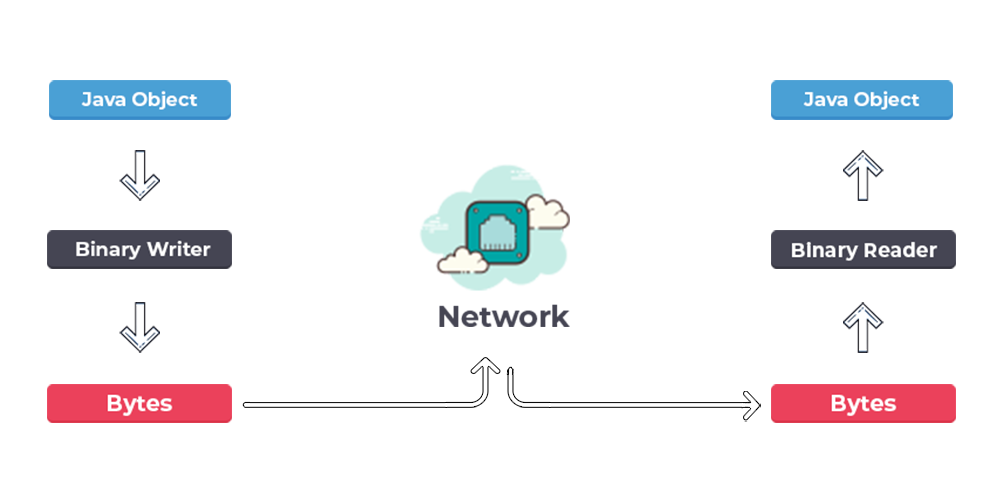
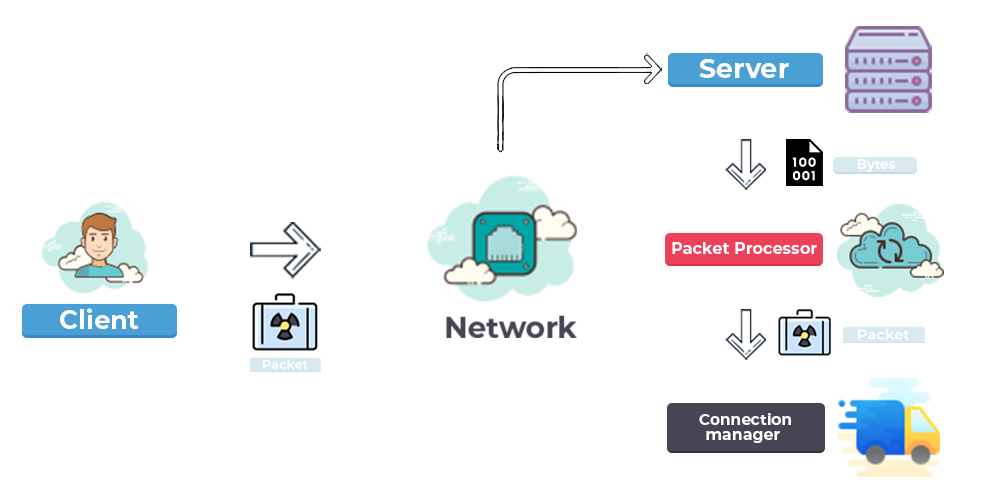
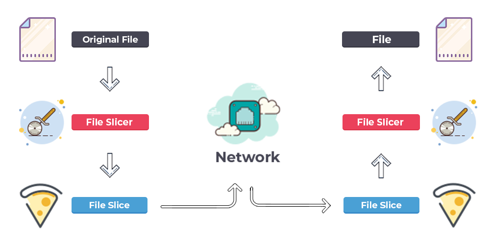

<!-- PROJECT LOGO -->
<br />
<p align="center">

<h1 align="center">
	 Java Encrypted File Transfer
</h1>

<p align="center">
	A simple encrypted file transfer application developed in Java.
</p>

<p align="center">
	
	
	
	
	
</p>

  <p align="center">
    Secure file transfer application.
    <br />
    <a href="https://github.com/ItsSharkz/JEFT"><strong>Explore the docs »</strong></a>
  </p>

<!-- TABLE OF CONTENTS -->
<details open="open">
  <summary><h2 style="display: inline-block">Table of Contents</h2></summary>
  <ol>
    <li>
      <a href="#about-the-project">About The Project</a>
      <ul>
        <li><a href="#built-with">Built With</a></li>
      </ul>
    </li>
    <li><a href="#getting-started">Getting Started</a></li>
    <li>
      <a href="#usage">Usage</a>
       <ul>
        <li><a href="#usage-server">Server</a></li>
        <li><a href="#usage-client">Client</a></li>
      </ul>
   </li>
    <li>
      <a href="#design">Application Design</a>
      <ul>
        <li><a href="#design-packet">Packet concept</a></li>
        <li><a href="#design-slice">File slice concept</a></li>
       </ul>
    </li>
    <li><a href="#improvements">Improvements</a></li>
    <li><a href="#contact">Contact</a></li>
  </ol>
</details>


<!-- ABOUT THE PROJECT -->

## About The Project
### Built With

* [Netty.io](https://netty.io/)
* [Apache Commons](https://commons.apache.org/)
* [SQLite](https://www.sqlite.org/)
* [FlatLaf](https://www.formdev.com/flatlaf/)
* [Bouncy Castle](https://www.bouncycastle.org/)
* [SLF4J](http://www.slf4j.org/)
* [Lombok](https://projectlombok.org/)
* [JUnit 5](https://junit.org/junit5/)

<!-- GETTING STARTED -->

## Getting Started

To get a local copy up and running follow these simple steps.

### Installation

1. Clone the repo
   ```sh
   git clone https://github.com/github_username/repo_name.git
   ```
2. Package the project
   ```maven
   mvn clean package
   ```

<!-- USAGE EXAMPLES -->

## Usage

### Server

To run the server, you just have to execute the jar file:

   ```sh
   java -jar server.jar
   ```

Once you started the server, you can prompt command, there is the commands list:

- stop
- help

### Client

The client can be run on any desktop os (OSx, Windows & Linux) by double clicking on it.

Once you launched the client interface, you needs to prompt an hostname. You can launch your own server and prompt its
hostname.

<!--  DESIGN -->

## Design

### Packet concept

Packets are groups of information sent across the network. The packets can contain any type of information, they will
ultimately be transformed into bytes to facilitate their transport. Once received, the bytes corresponding to the packet
information will be transformed back to their initial state. Note that each packet have a unique identifier to be able
to identify them, all these identifiers are stored in a centralized file.

Here are two diagrams explaining how they work:



### File Slicing concept

To transport files across the network, the best solution I've found is to split the files into slices. Each slice is
sent across the network in specific packets. Once received, a confirmation packet is sent to the sender. Once the
confirmation packet is received, a new slice is sent. This way you don't lose any slice in the process.

Here are a diagram explaining slices works:


<!-- IMPROVEMENTS -->

## Improvements

Here is a list of things that can be greatly improved:

- File slicing can be way more efficient.
- File transfer can be improved by reworking how they work, especially by improving errors and results handling.
- Client UI can be more intuitive with a single page containing all uploaded files and a button to upload new files.
  Maybe the hostname prompt can be removed to auto-connect to the server.

<!-- CONTACT -->

## Contact

Roch Blondiaux
:earth_americas: [www.roch-blondiaux.com](https://roch-blondiaux.com)
:email: [contact@roch-blondiaux.com](mailto:contact@roch-blondiaux.com)
